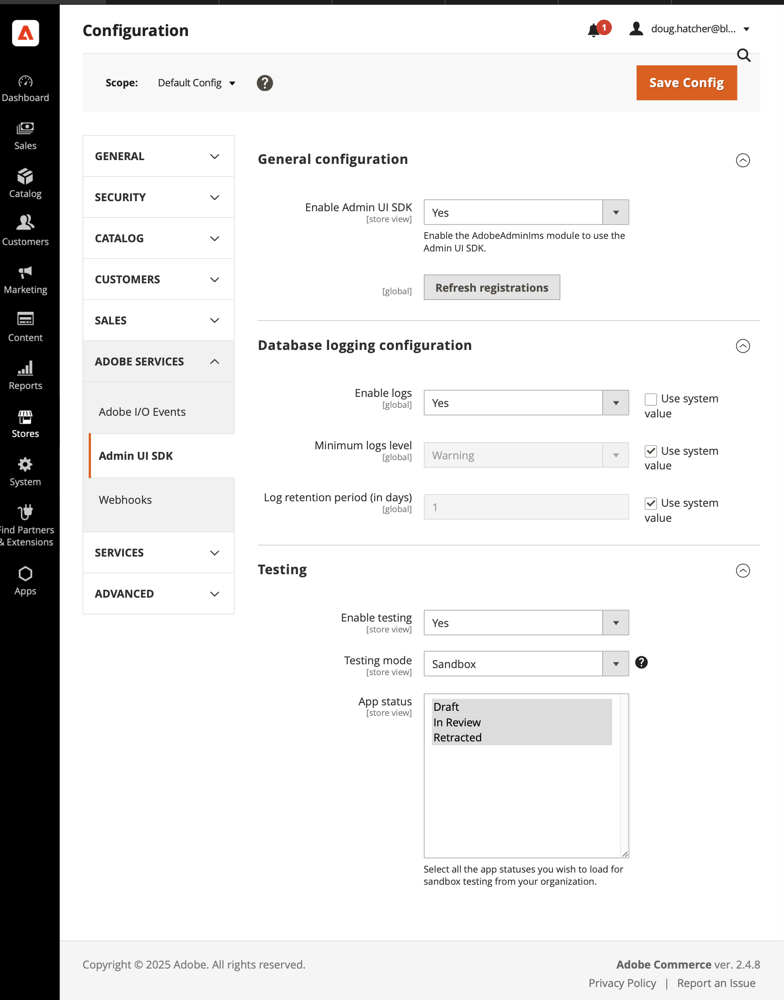
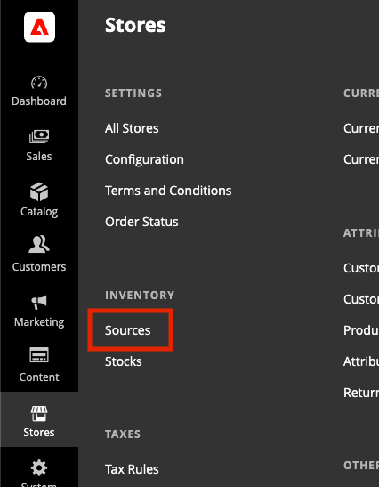
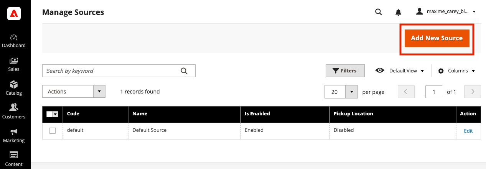

# Store Locator by Blue Acorn

This app introduces store locator functionality, allowing users to select a store and view details on a map using Adobe Commerce Storefront.

It integrates Leaflet.js to display store locations and enables filtering by ZIP code. It also provides store availability leveraging the native commerce APIs.

## Features

- Store availability by leveraging native inventory sources
- Loads Leaflet.js and its CSS for interactive maps.
- Displays a list of store locations retrieved from an API.
- Allows users to filter stores by ZIP code.
- Highlights the selected store and updates the session storage.
- Dynamically updates UI components with selected store details.

## Implementation

### 1. **Initialize the Block**

- Loads Leaflet.js and required CSS.
- Creates UI components including a store list, ZIP code filter, and interactive map.

### 2. **Fetch and Display Store Data**

- Retrieves store data from `/store-locator/stores.json`.
- Dynamically generates store cards and map markers.

### 3. **Interactive Store Selection**

- Clicking a store card triggers an event to update session storage.
- Updates the displayed selected store details.
- Scrolls the list and pans the map to the selected store.

### 4. **ZIP Code Filtering**

- Implements a form to filter stores by ZIP code.
- Hides stores that do not match the entered ZIP.
- Adjusts map marker visibility accordingly.

### 5. **Event Handling and Custom Events**

- Listens for `storeNum` and `updateAvailability` events.
- Updates UI dynamically when a store is selected.

## Local Setup

This guide will walk a merchant or a developer through how to set up this project with an Adobe Commerce SaaS Workspace. It assumes you have nothing but the following entitlements from Adobe:

### Pre-Reqs

- **Adobe Developer App Builder Project:** An active App Builder project configured for your Adobe Commerce instance's organization.
- **Adobe Commerce (Cloud, SaaS or On-Premise):** Version 2.4.x or higher.
- **Adobe I/O CLI:** For deploying App Builder actions.

* Local evironment running linux or compatible (i.e. MacOS or Windows with WCL2)
  - This repo contains a devcontainer suitable for running the solution, which requires a compatible IDE like Visual Studio Code and an OCI Runtime like Docker or Podman

### Setup SaaS and Storefront

If you haven't already, we need to prepare the project and workspaces within our Adobe App Builder organization, as well as the code repos that represent Adobe Commerce Storefront and any additional public apps you may need to use.

`aio commerce init` will create a few repos for you in github, so you must be authenticated with github. the `gh` tool can help with this.

```bash
$ gh auth login
$ aio commerce init
```

### Deploy The App

If you are in this repo and want to deploy this app, use `aio app use` to point to the right App Builder workspace. You can use the following sequence to set this up. You may also login to Adobe Developer App Builder Console, navigate to the project and workspace, and download a `workspace.json` that can also configure this project.

```bash
aio login
aio console org select
aio console project select
aio console workspace select
aio app use

aio app deploy # this will build the app and register it for use in Adobe Commerce
```

Once this is complete, you may add the app to your commerce instance by going to Stores > Configuration > Adobe Services > Admin UI SDK > Refresh Registrations, then in Configure Registrations selecting the app to use.

### Create an Integration in Adobe Commerce Admin

- This step allows your App Builder application to authenticate and communicate with your Adobe Commerce backend.

- In the Adobe Commerce Admin panel:
  - Navigate to:  
    `System > Extensions > Integrations`
    - Click **Add New Integration**

    - Fill in the following values:
      - **Name**: e.g. `Store Locator App Builder Integration`
      - Leave other fields blank unless required by your organization

    - Under the **API** tab, click **Select All** to grant all permissions, or configure scopes as needed

    - Save the integration and then **activate** it

    - You will be shown the following credentials:
      - **Consumer Key**
      - **Consumer Secret**
      - **Access Token**
      - **Access Token Secret**

- Remove the commented out Option 1 fields and update these to your `.env` file:

```env
  COMMERCE_CONSUMER_KEY=your-consumer-key
  COMMERCE_CONSUMER_SECRET=your-consumer-secret
  COMMERCE_ACCESS_TOKEN=your-access-token
  COMMERCE_ACCESS_TOKEN_SECRET=your-access-token-secret
```

This will allow the app to fetch commerce data in future updates.

### Register App to Commerce Instance

This app has an Administrative compliment, which requires the Adobe IMS and Admin UI SDK to be configured.

#### Setting up IMS

Behind the scenes, there is an app repository this gets registered with. It is exposed through IMS, so be sure to have your instances configured with IMS and in the same organization as your users and apps.

- [Setup IMS for Adobe Commerce](https://experienceleague.adobe.com/en/docs/commerce-admin/start/admin/ims/adobe-ims-config)

#### Setting up Admin UI SDK

Stores > Configuration > Adobe Services > Admin UI SDK and configure it to suit your needs.

### Running Locally



Once setup, click **Refresh Registrations** to bring in the app. This will expose the App in the _Apps_ section of the Main Admin Menu.

# Configuration

Store Locator leverages native Adobe Commerce SaaS Sources and Inventory to provide store locations and product availablity.

## Sources

You can find Sources in the Stores menu under Inventory.



### Add New Sources



### Configure Invnetory

Once sources are added, you can use can add inventory to the sources through Catalog > Products.

# Local Setup

## Setup

- Populate the `.env` file in the project root and fill it as shown [below](#env)

## Local Dev

- `aio app run` to start your local Dev server
- App will run on `localhost:9080` by default

By default the UI will be served locally but actions will be deployed and served from Adobe I/O Runtime. To start a
local serverless stack and also run your actions locally use the `aio app run --local` option.

## Test & Coverage

- Run `aio app test` to run unit tests for ui and actions
- Run `aio app test --e2e` to run e2e tests

## Deploy & Cleanup

- `aio app deploy` to build and deploy all actions on Runtime and static files to CDN
- `aio app undeploy` to undeploy the app

## Config

### `.env`

You can generate this file using the command `aio app use`.

```bash
# This file must **not** be committed to source control

## please provide your Adobe I/O Runtime credentials
# AIO_RUNTIME_AUTH=
# AIO_RUNTIME_NAMESPACE=
```

### `app.config.yaml`

- Main configuration file that defines an application's implementation.
- More information on this file, application configuration, and extension configuration
  can be found [here](https://developer.adobe.com/app-builder/docs/guides/appbuilder-configuration/#appconfigyaml)

#### Action Dependencies

- You have two options to resolve your actions' dependencies:
  1. **Packaged action file**: Add your action's dependencies to the root
     `package.json` and install them using `npm install`. Then set the `function`
     field in `app.config.yaml` to point to the **entry file** of your action
     folder. We will use `webpack` to package your code and dependencies into a
     single minified js file. The action will then be deployed as a single file.
     Use this method if you want to reduce the size of your actions.

  2. **Zipped action folder**: In the folder containing the action code add a
     `package.json` with the action's dependencies. Then set the `function`
     field in `app.config.yaml` to point to the **folder** of that action. We will
     install the required dependencies within that directory and zip the folder
     before deploying it as a zipped action. Use this method if you want to keep
     your action's dependencies separated.

## Debugging in VS Code

While running your local server (`aio app run`), both UI and actions can be debugged, to do so open the vscode debugger
and select the debugging configuration called `WebAndActions`.
Alternatively, there are also debug configs for only UI and each separate action.

## Typescript support for UI

To use typescript use `.tsx` extension for react components and add a `tsconfig.json`
and make sure you have the below config added

```
 {
  "compilerOptions": {
      "jsx": "react"
    }
  }
```
