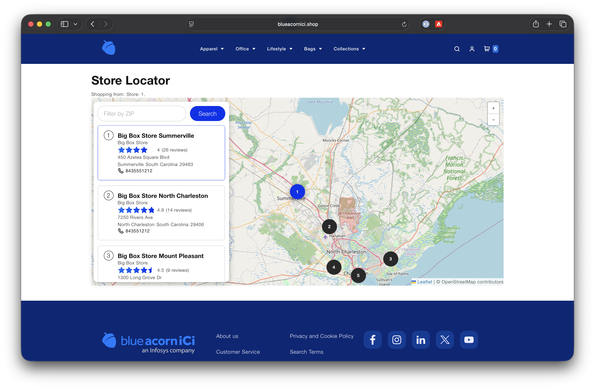
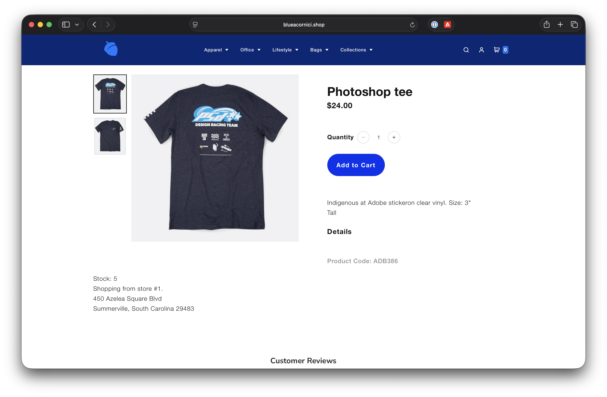

# Store Locator by Blue Acorn

This app introduces store locator functionality, allowing users to select a store and view details on a map using Adobe Commerce Storefront (Edge Delivery Services).

It integrates Leaflet.js to display store locations and enables filtering by ZIP code. It also provides store availability leveraging the native commerce APIs.

## Features

- Store availability by leveraging native inventory sources
- Interactive maps powered by Leaflet.js
- Store locations retrieved from an API and displayed as cards and map markers
- ZIP code filtering to narrow down store results
- Store selection with session storage persistence
- Dynamic UI updates when a store is selected
- Product availability per store via native Commerce inventory

## Setup Instructions

This guide walks a merchant or developer through setting up the Store Locator with Adobe Commerce. The app supports both **Adobe Commerce PaaS/On-Prem** and **Adobe Commerce SaaS** (Adobe Commerce as a Cloud Service).

### Pre-Reqs

- **Adobe Developer App Builder Project:** An active App Builder project configured for your Adobe Commerce instance's organization. The following APIs must be added to the project:
  - **Adobe Commerce as a Cloud Service** API (for SaaS environments)
  - **I/O Management API** (for PaaS and On-Prem environments)
- **Adobe Commerce:** Version 2.4.7 or higher / Adobe Commerce SaaS (Adobe Commerce as a Cloud Service).
- **Adobe I/O CLI and plugins:** For deploying App Builder actions.
  - For AIO CLI installation see (https://developer.adobe.com/runtime/docs/guides/tools/cli_install/)
  - Plugins:

  ```bash
  $ aio plugins:install @adobe/aio-cli-plugin-api-mesh
  $ aio plugins:install https://github.com/adobe-commerce/aio-cli-plugin-commerce
  ```

- Local environment running Linux or compatible (i.e. macOS or Windows with WSL2)
  - This repo contains a devcontainer suitable for running the solution, which requires a compatible IDE like Visual Studio Code and an OCI Runtime like Docker or Podman. The devcontainer is only available from the GitHub repository (https://github.com/BlueAcornInc/aio-commerce-storelocator).

### Adobe Commerce PaaS / On-Prem Setup

These steps apply to Adobe Commerce Cloud (PaaS) and On-Premise deployments.

#### 1. Install Required Commerce Modules

Install the following Composer packages on your Commerce instance:

```bash
# Admin UI SDK (required for app registration)
composer require "magento/commerce-backend-sdk":">=3.3"

# Storefront compatibility (required for EDS Storefront)
composer require adobe-commerce/storefront-compatibility

# IMS integration (required for App Builder communication)
composer require adobe-commerce/adobe-ims-metapackage
```

#### 2. Configure IMS

The app communicates with your Commerce instance through Adobe IMS. Ensure your instance is configured with IMS and belongs to the same organization as your App Builder project.

- [Setup IMS for Adobe Commerce](https://experienceleague.adobe.com/en/docs/commerce-admin/start/admin/ims/adobe-ims-config)

#### 3. Configure Admin UI SDK

Go to **Stores** > **Configuration** > **Adobe Services** > **Admin UI SDK** and configure it to suit your needs. Refer to official [documentation](https://developer.adobe.com/commerce/extensibility/admin-ui-sdk/configuration/#general-configuration) for more details.


#### 4. Create an Integration

This step allows your App Builder application to authenticate and communicate with your Commerce backend via OAuth 1.0a.

In the Adobe Commerce Admin panel:

1. Navigate to **System** > **Extensions** > **Integrations**
2. Click **Add New Integration**
3. Fill in the following:
   - **Name**: e.g. `Store Locator App Builder Integration`
   - Leave other fields blank unless required by your organization
4. Under the **API** tab, click **Select All** to grant all permissions, or configure scopes as needed
5. Save the integration and then **activate** it
6. You will be shown the following credentials:
   - **Consumer Key**
   - **Consumer Secret**
   - **Access Token**
   - **Access Token Secret**

These credentials will be entered in App Management (see [App Management Configuration](#app-management-configuration) below).

#### 5. Install Storefront Compatibility Package

For Adobe Commerce Cloud and On-Premise, install the Adobe Storefront compatibility package (PHP module). See the [Adobe Experience League](https://experienceleague.adobe.com/developer/commerce/storefront/setup/configuration/storefront-compatibility/install/) article for the complete procedure.

### Adobe Commerce SaaS Setup

These steps apply to Adobe Commerce as a Cloud Service (SaaS) deployments.

SaaS instances come with IMS, Admin UI SDK, and the Storefront compatibility layer **pre-configured**. No Composer packages or IMS setup is required.

#### 1. Ensure API Access

In the [Adobe Developer Console](https://developer.adobe.com/console/), verify that your App Builder project has the **Adobe Commerce as a Cloud Service** API added.

#### 2. Obtain IMS Credentials

For SaaS authentication, you will need:

- **IMS Client ID** — from your Adobe Developer Console project
- **IMS Client Secret** — from your Adobe Developer Console project

These credentials will be entered in App Management (see [App Management Configuration](#app-management-configuration) below).

### Setup EDS Storefront

> **Note:** This app is built for **Edge Delivery Services (EDS) Storefront** (document-based authoring). It is not designed for Luma or PWA Studio storefronts.

If you haven't already, prepare the project and workspaces within your Adobe App Builder organization, as well as the code repos that represent Adobe Commerce Storefront.

`aio commerce init` will create a few repos for you in GitHub, so you must be authenticated with GitHub. The `gh` tool can help with this.

```bash
$ gh auth login
$ aio commerce init
```

### Deploy The App

Use `aio app use` to point to the right App Builder workspace. You can use the following sequence to set this up. You may also log in to the Adobe Developer App Builder Console, navigate to the project and workspace, and download a `workspace.json` that can also configure this project.

> **Note:** Be sure to run `npm install` before deploying to ensure all dependencies are installed.

```bash
aio login
aio console org select
aio console project select
aio console workspace select
aio app use

npm install

aio app build
aio app deploy # this will build the app and register it for use in Adobe Commerce
```

Once this is complete, add the app to your Commerce instance by going to **Stores** > **Configuration** > **Adobe Services** > **Admin UI SDK** > **Refresh Registrations**, then in Configure Registrations selecting the app to use.

### Configure API Mesh (Optional)

This app includes a `mesh.json` configuration file that sets up an API Mesh to proxy Adobe Commerce GraphQL requests. The mesh routes requests through a single `AdobeCommerceAPI` source pointed at your Commerce instance's `/graphql` endpoint.

1. **Ensure the API Mesh plugin is installed:**

   ```bash
   aio plugins:install @adobe/aio-cli-plugin-api-mesh
   ```

2. **Create the mesh** (from the project root):

   The `COMMERCE_ENDPOINT` environment variable must be set to your Commerce instance URL in the `.env` file.

   ```bash
   aio api-mesh create mesh.json
   ```

   This registers the mesh with your App Builder workspace.

3. **Verify the mesh is running:**

   ```bash
   aio api-mesh get
   ```

   You should see the mesh configuration with the `AdobeCommerceAPI` source.

4. Always **Update the mesh** after configuration changes:

   ```bash
   aio api-mesh update mesh.json
   ```

For more details, see the [API Mesh documentation](https://developer.adobe.com/commerce/extensibility/api-mesh/).

### App Management Configuration

Store Locator uses **Adobe Commerce App Management** to securely store Commerce API credentials. Credentials are stored in App Builder and retrieved server-side by Runtime actions — never exposed in public storefront code.

#### `restApiBaseUrl` Format

The `restApiBaseUrl` field varies depending on your deployment type:

- **SaaS (Adobe Commerce as a Cloud Service):** The base URL usually includes the tenant ID and should **not** include `/rest`.
  - Example: `https://na1-sandbox.api.commerce.adobe.com/[tenant-id]/`
- **PaaS / On-Prem:** The base URL should end with `/rest/V1`.
  - Example: `https://[environment-name].us-4.magentosite.cloud/rest/V1`

#### Configuration Fields

The following fields are configurable via App Management (**Apps** > **App Management** > Store Locator > **Configure**):

| Field               | Type     | Description                                                 |
| ------------------- | -------- | ----------------------------------------------------------- |
| `restApiBaseUrl`    | URL      | Your Commerce REST API base URL (see format above)          |
| `authType`          | List     | Authentication type: `oauth` (PaaS/On-Prem) or `ims` (SaaS) |
| `consumerKey`       | Password | Commerce integration consumer key (OAuth only)              |
| `consumerSecret`    | Password | Commerce integration consumer secret (OAuth only)           |
| `accessToken`       | Password | Commerce integration access token (OAuth only)              |
| `accessTokenSecret` | Password | Commerce integration access token secret (OAuth only)       |
| `imsClientId`       | Password | Adobe IMS client ID (SaaS only)                             |
| `imsClientSecret`   | Password | Adobe IMS client secret (SaaS only)                         |

#### Setup by Deployment Type

**For PaaS/On-Premise (OAuth 1.0a):**

1. Set `restApiBaseUrl` to your Commerce URL ending with `/rest/V1`
2. Set `authType` to "PaaS/On-Premise (OAuth 1.0a)"
3. Enter your Integration credentials from Commerce Admin (System > Extensions > Integrations)

**For SaaS (IMS):**

1. Set `restApiBaseUrl` to your Commerce API URL with tenant ID (no `/rest` suffix)
2. Set `authType` to "SaaS (IMS)"
3. Enter your IMS client credentials from Adobe Developer Console


After configuring, go to **Stores** > **Configuration** > **Adobe Services** > **Admin UI SDK** and click **Refresh Registrations**.

#### Security Benefits

- **No exposed tokens:** Credentials never appear in public storefront code
- **Server-side authentication:** All API calls go through the inventory-proxy action
- **Automatic token management:** IMS tokens are automatically refreshed; OAuth tokens can be regenerated
- **Merchant-controlled:** Merchants configure credentials through Admin UI, not by editing code

### Configure Sources and Inventory

Store Locator leverages native Adobe Commerce Sources and Inventory to provide store locations and product availability.

You can find Sources in the Stores menu under Inventory.


#### Add New Sources


#### Configure Inventory

Once sources are added, you can add inventory to the sources through Catalog > Products.

## EDS Storefront Blocks

The Store Locator includes shared blocks for Adobe Commerce Storefront (Edge Delivery Services):

- **[Store Locator Block](blocks/store-locator/README.md)** — Interactive store finder with map, ZIP code filtering, and store selection.
- **[Product Availability Block](blocks/product-availability/README.md)** — Displays product inventory availability across store locations.

### Block Installation

See the [Blocks README](blocks/README.md) for npm installation and configuration instructions.

Alternatively, you can manually copy the `store-locator/` and `product-availability/` directories from `blocks/` to your storefront's `blocks/` directory.

### Document-based Authoring

To add the store locator block, create a table within the document you want to embed it, with the header named `store-locator`. This will reference the block copied in with the previous step.

In your EDS document (Google Doc, SharePoint, or da.live), add a single-cell table like this:


| store-locator |
| ------------- |
|               |

This renders as the following HTML on the storefront:

```html
<div class="store-locator-wrapper">
  <div class="store-locator block" data-block-name="store-locator">
    <div>
      <div></div>
    </div>
  </div>
</div>
```

The block's `decorate()` function then populates it with the interactive map, store list, ZIP code filter, and store selection UI.

Here is the below example of store-locator block being added to the Products Details Page.



With the AEM Sidekick installed, you can manage the entire store locator experience from your authoring environment (Google Drive, SharePoint, or da.live). Edit your `store-locator/stores` sheet and use AEM Sidekick to Preview and Publish the changes. This produces a `stores.json` file that drives the store locator experience via the shared block.

### Product Availability Block

To add the product availability block to a page, create a single-cell table in your EDS document with the header `product-availability`:

| product-availability |
| -------------------- |
|                      |

The block displays product stock availability for the currently selected store. It works in concert with the Store Locator block:

1. When a user selects a store in the Store Locator, the selection is saved to `sessionStorage`.
2. The Product Availability block queries the Catalog Service GraphQL API (the same `commerce-endpoint` used by the rest of the storefront) for product stock status.
3. If a store is selected, the block displays whether the product is in stock at that location. If no store is selected, it prompts the user to choose one.

> **Note:** The block uses the storefront's existing `commerce-endpoint` and Catalog Service headers from `configs.json` — no additional configuration is required. It works with both Adobe Commerce SaaS and PaaS deployments. See the [Product Availability Block README](blocks/product-availability/README.md) for implementation details.



## Local Development

### Setup

- Populate the `.env` file in the project root and fill it as shown [below](#env)

### Local Dev

- `aio app run` to start your local Dev server
- App will run on `localhost:9080` by default

By default the UI will be served locally but actions will be deployed and served from Adobe I/O Runtime. To start a
local serverless stack and also run your actions locally use the `aio app run --local` option.

### Deploy & Cleanup

- `aio app deploy` to build and deploy all actions on Runtime and static files to CDN
- `aio app undeploy` to undeploy the app

### `.env`

You can generate this file using the command `aio app use`.

```bash
# This file must **not** be committed to source control

## please provide your Adobe I/O Runtime credentials
# AIO_RUNTIME_AUTH=
# AIO_RUNTIME_NAMESPACE=
```

### Debugging in VS Code

While running your local server (`aio app run`), both UI and actions can be debugged, to do so open the vscode debugger
and select the debugging configuration called `WebAndActions`.
Alternatively, there are also debug configs for only UI and each separate action.
