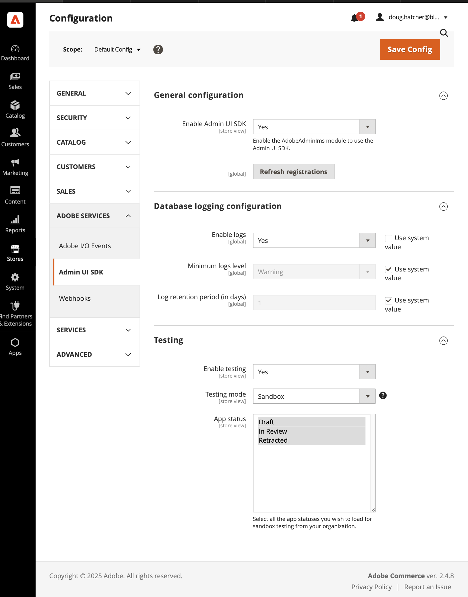
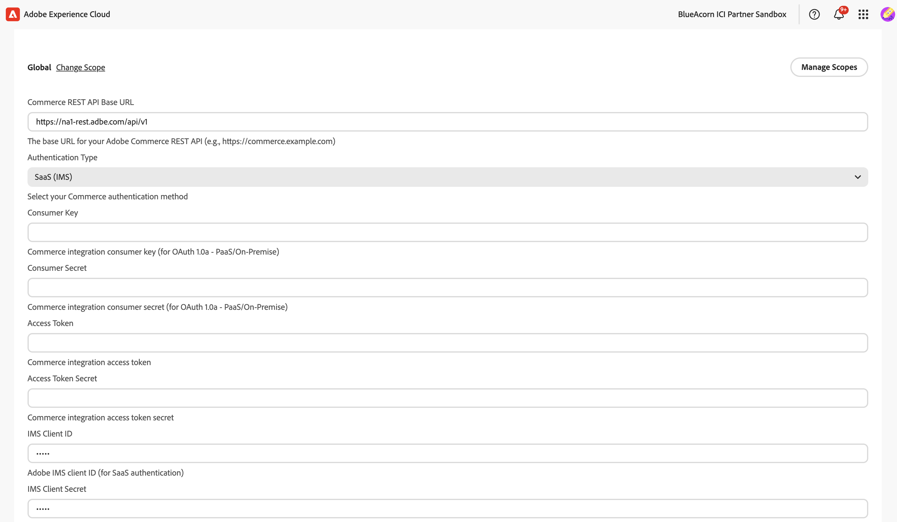
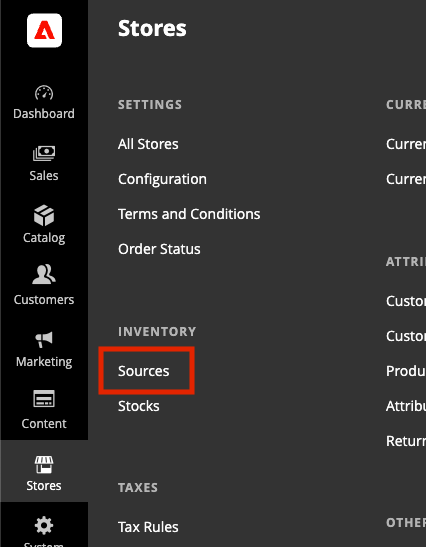
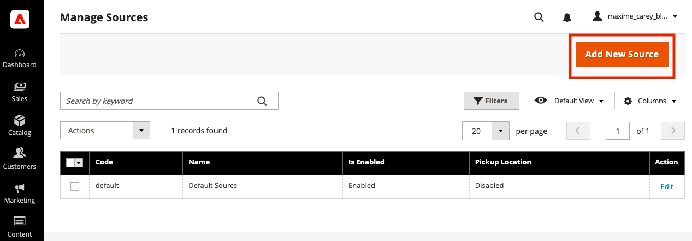
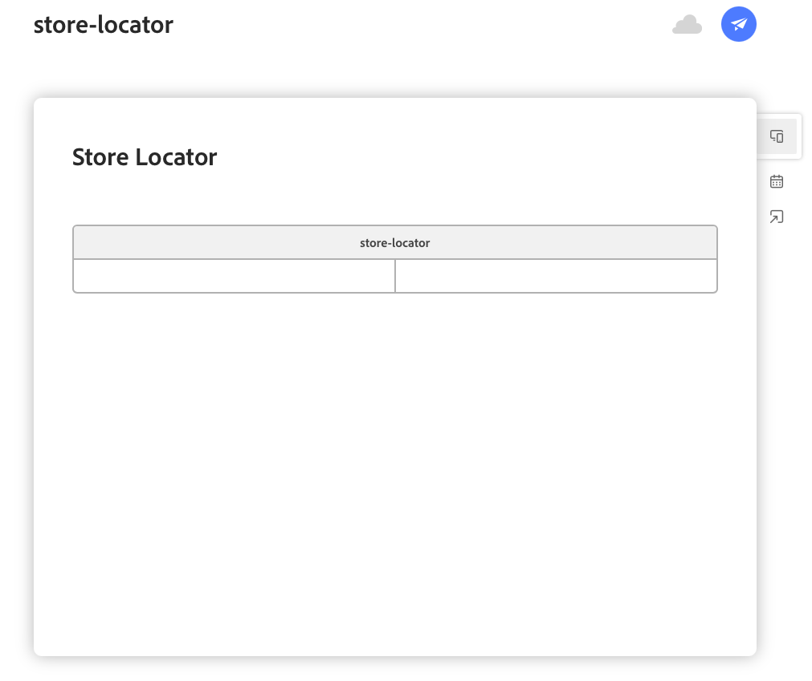

# Store Locator by Blue Acorn

This app introduces store locator functionality, allowing users to select a store and view details on a map using Adobe Commerce Storefront.

It integrates Leaflet.js to display store locations and enables filtering by ZIP code. It also provides store availability leveraging the native commerce APIs.

## Features

- Store availability by leveraging native inventory sources
- Loads Leaflet.js and its CSS for interactive maps.
- Displays a list of store locations retrieved from an API.
- Allows users to filter stores by ZIP code.
- Highlights the selected store and updates the session storage.
- Dynamically updates UI components with selected store details.

## Implementation

### 1. **Initialize the Block**

- Loads Leaflet.js and required CSS.
- Creates UI components including a store list, ZIP code filter, and interactive map.

### 2. **Fetch and Display Store Data**

- Retrieves store data from `/store-locator/stores.json`.
- Dynamically generates store cards and map markers.

### 3. **Interactive Store Selection**

- Clicking a store card triggers an event to update session storage.
- Updates the displayed selected store details.
- Scrolls the list and pans the map to the selected store.

### 4. **ZIP Code Filtering**

- Implements a form to filter stores by ZIP code.
- Hides stores that do not match the entered ZIP.
- Adjusts map marker visibility accordingly.

### 5. **Event Handling and Custom Events**

- Listens for `storeNum` and `updateAvailability` events.
- Updates UI dynamically when a store is selected.

## Setup

This guide will walk a merchant or a developer through how to set up this project with Adobe Commerce. It assumes you have nothing but the following entitlements from Adobe:

### Pre-Reqs

- **Adobe Developer App Builder Project:** An active App Builder project configured for your Adobe Commerce instance's organization.
- **Adobe Commerce:** Version 2.4.7 or higher.
- **Adobe I/O CLI and plugins:** For deploying App Builder actions.
  - For AIO CLI installation see (https://developer.adobe.com/runtime/docs/guides/tools/cli_install/)
  - Plugins:

  ```bash
  $ aio plugins:install @adobe/aio-cli-plugin-api-mesh
  $ aio plugins:install https://github.com/adobe-commerce/aio-cli-plugin-commerce
  ```

- **Adobe Commerce Modules (PaaS and On-Prem only)**:
  - Admin UI SDK module (magento/commerce-backend-sdk >= 3.3.0)
  - Storefront extension module (adobe-commerce/storefront-compatibility)
  - IMS module (adobe-commerce/adobe-ims-metapackage)

* Local environment running linux or compatible (i.e. MacOS or Windows with WSL2)
  - This repo contains a devcontainer suitable for running the solution, which requires a compatible IDE like Visual Studio Code and an OCI Runtime like Docker or Podman. The devcontainer is only available from the GitHub repository (https://github.com/BlueAcornInc/aio-commerce-storelocator).

### Setup Storefront

If you haven't already, we need to prepare the project and workspaces within our Adobe App Builder organization, as well as the code repos that represent Adobe Commerce Storefront and any additional public apps you may need to use.

`aio commerce init` will create a few repos for you in github, so you must be authenticated with github. the `gh` tool can help with this.

```bash
$ gh auth login
$ aio commerce init
```

For Adobe Commerce Cloud and on-premise installation, you will need to install Adobe Storefront compatibility package, a PHP module. See [Adobe Experience League](https://experienceleague.adobe.com/developer/commerce/storefront/setup/configuration/storefront-compatibility/install/) article for the complete procedure.

### Deploy The App

If you are in this repo and want to deploy this app, use `aio app use` to point to the right App Builder workspace. You can use the following sequence to set this up. You may also login to Adobe Developer App Builder Console, navigate to the project and workspace, and download a `workspace.json` that can also configure this project.

> **Note:** Be sure to run `npm install` before deploying to ensure all dependencies are installed.

```bash
aio login
aio console org select
aio console project select
aio console workspace select
aio app use

npm install

aio app deploy # this will build the app and register it for use in Adobe Commerce
```

Once this is complete, you may add the app to your commerce instance by going to Stores > Configuration > Adobe Services > Admin UI SDK > Refresh Registrations, then in Configure Registrations selecting the app to use.

### Create an Integration in Adobe Commerce Admin

- This step allows your App Builder application to authenticate and communicate with your Adobe Commerce backend.

- In the Adobe Commerce Admin panel:
  - Navigate to:
    `System > Extensions > Integrations`
    - Click **Add New Integration**

    - Fill in the following values:
      - **Name**: e.g. `Store Locator App Builder Integration`
      - Leave other fields blank unless required by your organization

    - Under the **API** tab, click **Select All** to grant all permissions, or configure scopes as needed

    - Save the integration and then **activate** it

    - You will be shown the following credentials:
      - **Consumer Key**
      - **Consumer Secret**
      - **Access Token**
      - **Access Token Secret**

- Remove the commented out Option 1 fields and update these to your `.env` file:

```env
  COMMERCE_CONSUMER_KEY=your-consumer-key
  COMMERCE_CONSUMER_SECRET=your-consumer-secret
  COMMERCE_ACCESS_TOKEN=your-access-token
  COMMERCE_ACCESS_TOKEN_SECRET=your-access-token-secret
```

This will allow the app to fetch commerce data in future updates.

### Register App to Commerce Instance

This app has an Administrative compliment, which requires the Adobe IMS and Admin UI SDK to be configured.

> **PaaS & On-Prem Only:** The following steps (IMS configuration, Admin UI SDK composer install) apply to PaaS and On-Premise deployments. SaaS instances have these pre-configured.

#### Setting up IMS

Behind the scenes, there is an app repository this gets registered with. It is exposed through IMS, so be sure to have your instances configured with IMS and in the same organization as your users and apps.

- [Setup IMS for Adobe Commerce](https://experienceleague.adobe.com/en/docs/commerce-admin/start/admin/ims/adobe-ims-config)

#### Setting up Admin UI SDK

Complete the [Admin UI SDK installation process](https://developer.adobe.com/commerce/extensibility/admin-ui-sdk/installation/) and install version `3.3.0` or higher:

```bash
composer require "magento/commerce-backend-sdk": ">=3.3"
```

Stores > Configuration > Adobe Services > Admin UI SDK and configure it to suit your needs. Refer to official [documentation](https://developer.adobe.com/commerce/extensibility/admin-ui-sdk/configuration/#general-configuration) for more details.

#### Running Locally



Once setup, click **Refresh Registrations** to bring in the app. This will expose the App in the _Store Locator_ section of the Main Admin Menu.

## Configuration

Store Locator leverages native Adobe Commerce Sources and Inventory to provide store locations and product availability.

### App Management Configuration

Store Locator uses **Adobe Commerce App Management** to securely store Commerce API credentials. This replaces the previous approach of storing tokens in public configuration files.

#### What is App Management?

App Management provides a secure, merchant-facing UI in Commerce Admin (Apps > App Management) for configuring app settings. Credentials are stored securely in App Builder and retrieved server-side by Runtime actions — never exposed in public storefront code.

#### Configuration Fields

The following fields are configurable via App Management:

| Field               | Type     | Description                                                            |
| ------------------- | -------- | ---------------------------------------------------------------------- |
| `restApiBaseUrl`    | URL      | Your Commerce REST API base URL (e.g., `https://commerce.example.com`) |
| `authType`          | List     | Authentication type: `oauth` (PaaS/On-Prem) or `ims` (SaaS)            |
| `consumerKey`       | Password | Commerce integration consumer key (OAuth only)                         |
| `consumerSecret`    | Password | Commerce integration consumer secret (OAuth only)                      |
| `accessToken`       | Password | Commerce integration access token (OAuth only)                         |
| `accessTokenSecret` | Password | Commerce integration access token secret (OAuth only)                  |
| `imsClientId`       | Password | Adobe IMS client ID (SaaS only)                                        |
| `imsClientSecret`   | Password | Adobe IMS client secret (SaaS only)                                    |

#### Setup Instructions

1. **Deploy the app first:**

   ```bash
   aio app deploy
   ```

2. **Register the app in Commerce Admin:**
   - Go to **Apps** > **App Management**
   - Find "Store Locator" and click **Configure**
   - Fill in your Commerce credentials based on your deployment type:

   **For PaaS/On-Premise:**
   - Set `authType` to "PaaS/On-Premise (OAuth 1.0a)"
   - Enter your Integration credentials from Commerce Admin (System > Extensions > Integrations)

   **For SaaS:**
   - Set `authType` to "SaaS (IMS)"
   - Enter your IMS client credentials

   

3. **Refresh registrations:**
   - Go to **Stores** > **Configuration** > **Adobe Services** > **Admin UI SDK**
   - Click **Refresh Registrations**

#### Security Benefits

- **No exposed tokens:** Credentials never appear in public storefront code
- **Server-side authentication:** All API calls go through the inventory-proxy action
- **Automatic token management:** IMS tokens are automatically refreshed; OAuth tokens can be regenerated
- **Merchant-controlled:** Merchants configure credentials through Admin UI, not by editing code

### Sources

You can find Sources in the Stores menu under Inventory.



#### Add New Sources



#### Configure Inventory

Once sources are added, you can add inventory to the sources through Catalog > Products.

## Storefront Blocks

The Store Locator includes shared blocks for Adobe Commerce Storefront (Edge Delivery Services):

- **[Store Locator Block](blocks/store-locator/README.md)** — Interactive store finder with map, ZIP code filtering, and store selection.
- **[Product Availability Block](blocks/product-availability/README.md)** — Displays product inventory availability across store locations.

### Block Installation

See the [Blocks README](blocks/README.md) for npm installation and configuration instructions.

Alternatively, you can manually copy the `store-locator/` and `product-availability/` directories from `blocks/` to your storefront's `blocks/` directory.

### Document-based Authoring

To add the store locator block, create a table within the document you want to embed it, with the header named `store-locator`. This will reference the block copied in with the previous step.



With the AEM Sidekick installed, you can manage the entire store locator experience from your authoring environment (Google Drive, SharePoint, or da.live). Edit your `store-locator/stores` sheet and use AEM Sidekick to Preview and Publish the changes. This produces a `stores.json` file that drives the store locator experience via the shared block.

## Local Development

### Setup

- Populate the `.env` file in the project root and fill it as shown [below](#env)

### Local Dev

- `aio app run` to start your local Dev server
- App will run on `localhost:9080` by default

By default the UI will be served locally but actions will be deployed and served from Adobe I/O Runtime. To start a
local serverless stack and also run your actions locally use the `aio app run --local` option.

### Deploy & Cleanup

- `aio app deploy` to build and deploy all actions on Runtime and static files to CDN
- `aio app undeploy` to undeploy the app

### `.env`

You can generate this file using the command `aio app use`.

```bash
# This file must **not** be committed to source control

## please provide your Adobe I/O Runtime credentials
# AIO_RUNTIME_AUTH=
# AIO_RUNTIME_NAMESPACE=
```

### Debugging in VS Code

While running your local server (`aio app run`), both UI and actions can be debugged, to do so open the vscode debugger
and select the debugging configuration called `WebAndActions`.
Alternatively, there are also debug configs for only UI and each separate action.
