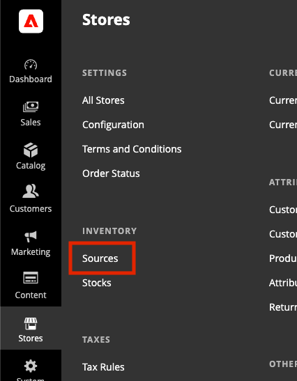

# Configuration

Store Locator leverages native Adobe Commerce SaaS Sources and Inventory to provide store locations and product availablity. 

## Sources

You can find Sources in the Stores menu under Inventory.

### Add New Sources

### Configure Invnetory

Once sources are added, you can use can add inventory to the sources through Catalog > Products. 

