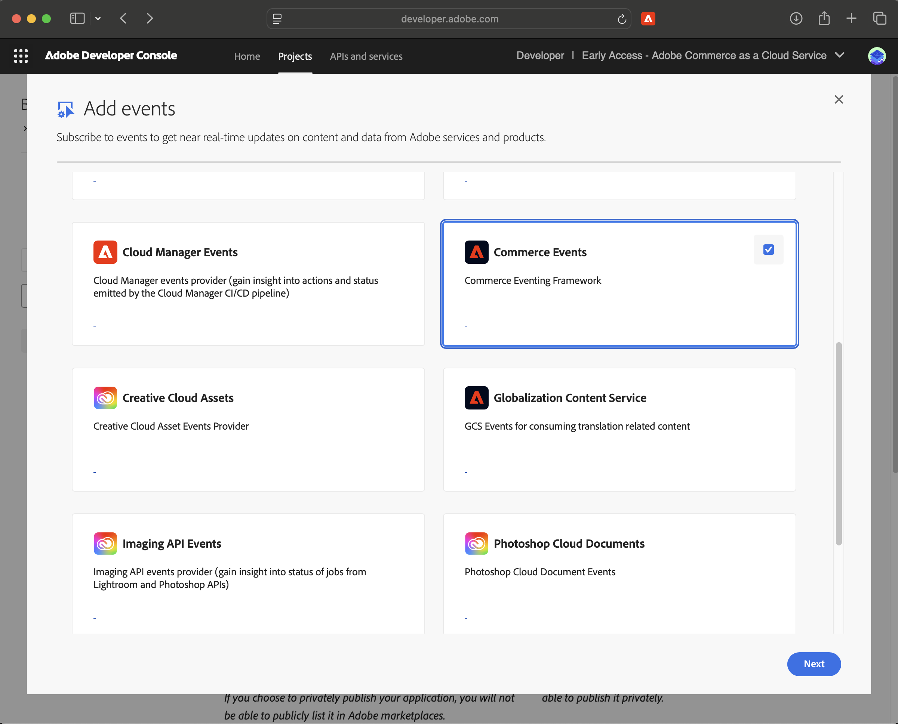

# Installation

This guide will walk a merchant or a developer through how to set up this project with an Adobe Commerce SaaS Workspace. It assumes you have nothing but the following entitlements from Adobe:

## Pre-Reqs

* Adobe Developer App Builder 
* Access to a working Adobe Commerce as a Cloud Service (SaaS) tenant
* Local evironment running linux or compatible (i.e. MacOS or Windows with WCL2)
    * This repo contains a devcontainer suitable for running the solution, which requires a compatible IDE like Visual Studio Code and an OCI Runtime like Docker or Podman

## Setup SaaS and Storefront

If you haven't already, we need to prepare the project and workspaces within our Adobe App Builder organization, as well as the code repos that represent Adobe Commerce Storefront and any additional public apps you may need to use.

`aio commerce init` will create a few repos for you in github, so you must be authenticated with github. the `gh` tool can help with this.

```bash
$ gh auth login 
$ aio commerce init
```

## **Create an Integration in Adobe Commerce Admin**

- This step allows your App Builder application to authenticate and communicate with your Adobe Commerce backend.

- In the Adobe Commerce Admin panel:

   - Navigate to:  
     `System > Extensions > Integrations`

     - Click **Add New Integration**

     - Fill in the following values:
        - **Name**: e.g. `Stripe App Builder Integration`
        - Leave other fields blank unless required by your organization

     - Under the **API** tab, click **Select All** to grant all permissions, or configure scopes as needed

     - Save the integration and then **activate** it

     - You will be shown the following credentials:
        - **Consumer Key**
        - **Consumer Secret**
        - **Access Token**
        - **Access Token Secret**

- Remove the commented out Option 1 fields and update these to your `.env` file:

```env
  COMMERCE_CONSUMER_KEY=your-consumer-key
  COMMERCE_CONSUMER_SECRET=your-consumer-secret
  COMMERCE_ACCESS_TOKEN=your-access-token
  COMMERCE_ACCESS_TOKEN_SECRET=your-access-token-secret
```

## **Enable Adobe I/O Events in Adobe Commerce Admin**


Take a look at https://developer.adobe.com/events/docs/guides/appbuilder/ !!

- First, we need to make sure we have events enabled in our app. In the App Builder Developer Panel, pull up the project we want to use (i.e. created in the previous step) and select the workspace, Add an Event, and Add the Adobe Commerce Eventing.




- In your Adobe Commerce Admin panel:

  - Navigate to:  
    `Stores > Configuration > Adobe Services > Adobe I/O Events > Commerce Events`

  - Set **"Enable Adobe I/O Events"** to `Yes`

  - Fill in the following required fields:
     - **Merchant ID**
     - **Environment ID**

- These values link your Commerce instance to your Adobe I/O Events provider.

- Once saved, copy the values and add them to your `.env` file:
- ```env
  COMMERCE_ADOBE_IO_EVENTS_MERCHANT_ID=your-merchant-id-here
  COMMERCE_ADOBE_IO_EVENTS_ENVIRONMENT_ID=your-environment-id-here

